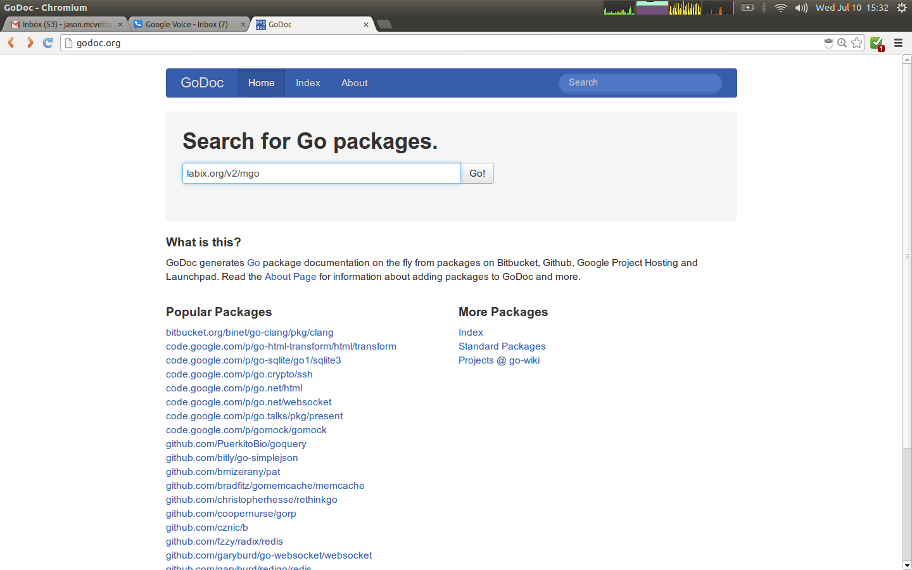
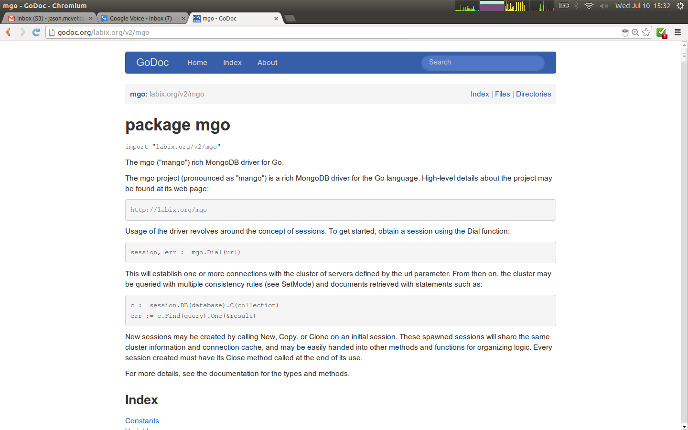
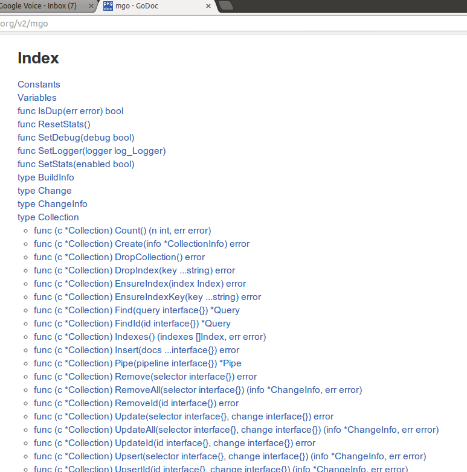
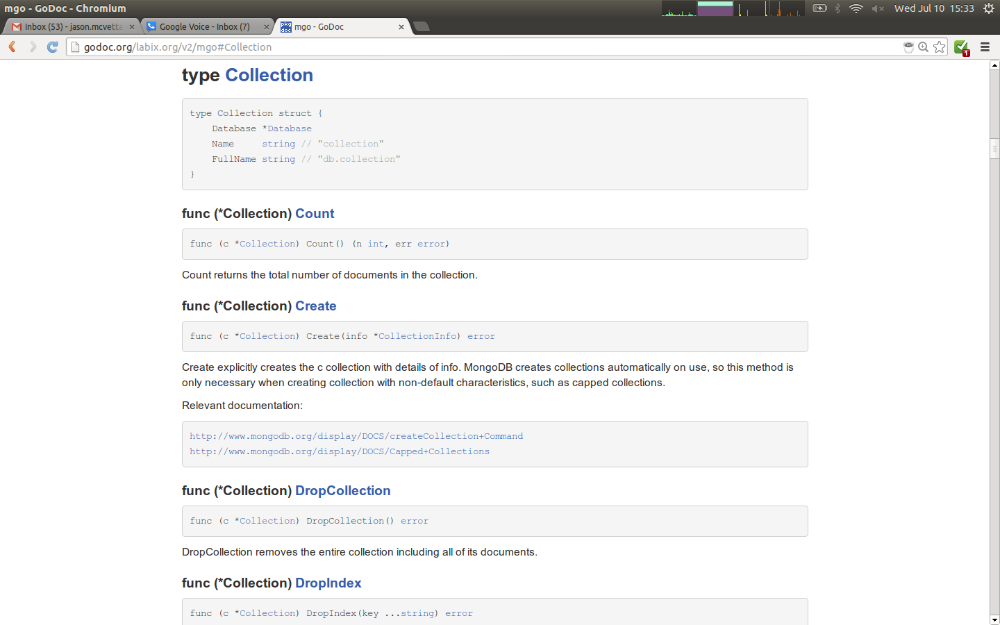
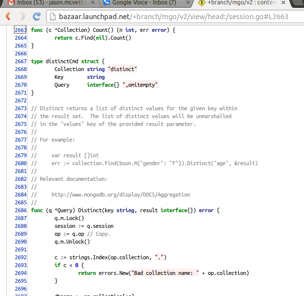

*************
Documentation
*************

Good documentation is an essential part of any Go program.  You will frequently
need to read and understand the documentation for 3rd Party Open Source
libraries.  As you become a skilled Gopher you will probably also want to
publish your own Open Source packages.  A well-documented package attracts more
users, and reflects well on its author.

Self-Documenting Code
=====================

Go code is `self-documenting`_, meaning the source code explains itself without
needing external documentation.  If you include doc comments in your code as
described below, tools like ``godoc`` will automatically generate useful
documentation for your packages. [#cit1]_

Package Comments
----------------

Every package should have a *package comment*, a block comment preceding the
package clause. For multi-file packages, the package comment only needs to be
present in one file, and any one will do. The package comment should introduce
the package and provide information relevant to the package as a whole. It will
appear first on the godoc page and should set up the detailed documentation that
follows.

.. code-block:: go

   /*
   Package regexp implements a simple library for regular expressions.
   
   The syntax of the regular expressions accepted is:
   
       regexp:
           concatenation { '|' concatenation }
       concatenation:
           { closure }
       closure:
           term [ '*' | '+' | '?' ]
       term:
           '^'
           '$'
           '.'
           character
           '[' [ '^' ] character-ranges ']'
           '(' regexp ')'
   */
   package regexp

If the package is simple, the package comment can be brief.

.. code-block:: go

   // Package path implements utility routines for
   // manipulating slash-separated filename paths.
   package path
   
Comments do not need extra formatting such as banners of stars. The generated
output may not even be presented in a fixed-width font, so don't depend on
spacing for alignment—godoc, like gofmt, takes care of that. The comments are
uninterpreted plain text, so HTML and other annotations such as _this_ will
reproduce verbatim and should not be used. One adjustment godoc does do is to
display indented text in a fixed-width font, suitable for program snippets. The
package comment for the fmt package uses this to good effect.

Depending on the context, godoc might not even reformat comments, so make sure
they look good straight up: use correct spelling, punctuation, and sentence
structure, fold long lines, and so on.

Doc Comments
------------

Inside a package, any comment immediately preceding a top-level declaration
serves as a *doc comment* for that declaration. Every exported (capitalized)
name in a program should have a doc comment.

Doc comments work best as complete sentences, which allow a wide variety of
automated presentations. The first sentence should be a one-sentence summary
that starts with the name being declared.

.. code-block:: go

   // Compile parses a regular expression and returns, if successful, a Regexp
   // object that can be used to match against text.
   func Compile(str string) (regexp *Regexp, err error) {

If the name always begins the comment, the output of godoc can usefully be run
through grep. Imagine you couldn't remember the name "Compile" but were looking
for the parsing function for regular expressions, so you ran the command,

.. code-block:: console

   $ godoc regexp | grep parse

If all the doc comments in the package began, "This function...", grep wouldn't
help you remember the name. But because the package starts each doc comment with
the name, you'd see something like this, which recalls the word you're looking
for.

.. code-block:: console

   $ godoc regexp | grep parse
       Compile parses a regular expression and returns, if successful, a Regexp
       parsed. It simplifies safe initialization of global variables holding
       cannot be parsed. It simplifies safe initialization of global variables
   $

Go's declaration syntax allows grouping of declarations. A single doc comment
can introduce a group of related constants or variables. Since the whole
declaration is presented, such a comment can often be perfunctory.

.. code-block:: go

   // Error codes returned by failures to parse an expression.
   var (
       ErrInternal      = errors.New("regexp: internal error")
       ErrUnmatchedLpar = errors.New("regexp: unmatched '('")
       ErrUnmatchedRpar = errors.New("regexp: unmatched ')'")
       ...
   )

Uncommented Code Is Broken
--------------------------

Seriously, if your code doesn't have good doc comments, it is by definition lousy code.  

.. todo:: 

   Write a short diatribe on the importance of code commentary.

``godoc`` tool
==============

Godoc extracts and generates documentation for Go programs. [#cit2]_

It has two modes.

Without the ``-http`` flag, it runs in command-line mode and prints plain text
documentation to standard output and exits. If both a library package and a
command with the same name exists, using the prefix cmd/ will force
documentation on the command rather than the library package. If the ``-src``
flag is specified, godoc prints the exported interface of a package in Go source
form, or the implementation of a specific exported language entity::

   godoc fmt                # documentation for package fmt
   godoc fmt Printf         # documentation for fmt.Printf
   godoc cmd/go             # force documentation for the go command
   godoc -src fmt           # fmt package interface in Go source form
   godoc -src fmt Printf    # implementation of fmt.Printf

With the ``-http`` flag, it runs as a web server and presents the documentation
as a web page.

::

   godoc -http=:6060

GoDoc.org
=========

GoDoc_ is an open source web application that displays documentation for Go
packages on Bitbucket, Github, Launchpad and Google Project Hosting. It is
similar to the ``godoc`` command, but can display documentation for any open
source Go module specified by its import URL.

Using GoDoc.org
---------------

To view a package's documentation on GoDoc.org you enter its import path.  Let's
check out the docs for ``mgo``, the popular MongoDB database driver.  Its import
path is ``labix.org/v2/mgo``.

We could also haved typed in just "mgo" and GoDoc would show us packages with
that string in their name.  However it is does not attempt to rank results by
relevance or popularity, so the actual ``mgo`` driver would not be one of the
first few results.

Click "Go!" and GoDoc will display the documentation for our package.  The
documentation starts with the package's name, import path, and package comment.

   
Up next is an alphabetical index of all the exported entities in the package -
constants, variables, types, and functions.  Methods are displayed beneath the
type to which they are bound.

Click on the index entry for ``Collection`` to be taken to its detailed
documentation.  The exported fields and methods of structs are displayed, as
well as the type signature of functions and methods.  The entity's doc comment
is displayed, if it has one.

   
Sometimes the documentation is not enough, and we want to look at the source
code.  Click on the function name ``Count`` to see its source.

   

Open Source
-----------

GoDoc.org is open source!  If you want to see how it works, check out
https://github.com/garyburd/gddo!

Go Walker
---------

Also check out `Go Walker`_, a new enhanced version of GoDoc that displays code
snippets alongside the documentation.

.. _GoDoc: http://godoc.org
.. _`self-documenting`: http://en.wikipedia.org/wiki/Self-documenting
.. _`Go Walker`: http://gowalker.org

.. rubric:: Citations

.. [#cit1] The following sections mostly copied from http://golang.org/doc/effective_go.html#commentary
.. [#cit2] The following section copied from the package comment of ``godoc``